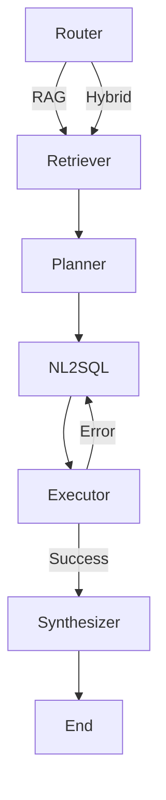

# Retail Analytics Copilot (LangGraph + DSPy)

This project implements a local, privacy-first AI agent designed to answer complex retail analytics questions. It combines **RAG** (Retrieval-Augmented Generation) for policy questions with **Text-to-SQL** for database queries, orchestrated by **LangGraph**.

The core **Natural Language to SQL (NL → SQL)** module has been optimized using **DSPy**, achieving a **30% improvement** in valid SQL generation rates on a local 3.8B parameter model.

## 1. System Architecture (Graph Design)

The agent operates as a stateful graph with a self-correcting repair loop.



### Node Responsibilities
1.  **Router:** Classifies questions as `rag` (static knowledge) or `hybrid` (database + math).
2.  **Retriever:** Fetches relevant documentation chunks (e.g., KPI definitions, Marketing Calendar) using BM25.
3.  **Planner:** Deconstructs the user question into a structured execution plan (Time Scope, Filters, Ranking Intent).
4.  **NL → SQL (Optimized):** Converts the structured plan into a valid SQLite query.
5.  **Executor:** Runs the query against the local `northwind.sqlite` database. returns raw rows or error messages.
6.  **Synthesizer:** Combines SQL results and retrieved text to produce a strictly formatted JSON response.
7.  **Repair Loop:** If the Executor encounters an error (syntax, missing column), the state loops back to **NL → SQL** with error context for correction (up to 2 retries).

---

## 2. DSPy Optimization

We utilized **DSPy** to optimize the most fragile component of the system: the **NL → SQL** generator.

### The Problem
Using manual prompting with a small local model (`Phi-3.5-mini`), the baseline SQL generator suffered from:
*   **Hallucinations:** Inventing non-existent syntax like `BETWEDIR` or `strftForms`.
*   **Schema Confusion:** Failing to join the `orders` table for date filters or `categories` table for names.
*   **Logic Errors:** Incorrectly applying `GROUP BY` on global aggregation questions (e.g., calculating "Average Order Value" per customer instead of globally).

### The Solution
*   **Module:** `GenerateSQL` (Signature: `question + plan + schema -> sql`).
*   **Optimizer:** `BootstrapFewShot`.
*   **Teacher:** The optimizer used a handcrafted "Gold Standard" dataset to learn effective patterns.
*   **Metric:** **Execution Success Rate** (Does the SQL run without error?).

### Training Data
*   **Training Set:** 30 handcrafted examples covering edge cases (Global Totals, Rankings, Date Ranges, "All Time" queries).
*   **Validation Set:** 10 held-out examples.

---

## 3. Results & Analysis

We compared the performance of the **Baseline (Manual Prompt)** against the **Compiled (DSPy Optimized)** module on a held-out validation set.

| Metric                       | Baseline | DSPy Optimized |  Delta   |
| :--------------------------- | :------: | :------------: | :------: |
| **Valid SQL Execution Rate** | **60%**  |    **90%**     | **+30%** |

### Impact Analysis
The optimization moved the system from "Unstable" to "Reliable":

1.  **Elimination of Hallucinations:** The optimizer selected few-shot examples that reinforced standard syntax (`>=`, `<=`) over complex keywords (`BETWEEN`), effectively stopping the model from inventing words like `BETWEDIR`.
2.  **Schema Grounding:** The optimized prompts consistently enforced necessary `JOIN` operations (e.g., always joining `orders` for temporal queries), preventing "no such column" errors.
3.  **Graph Efficiency:** By increasing the SQL success rate to 90%, the agent triggers the **Repair Loop** significantly less often. This reduces latency and token usage per question.

---

## 4. Trade-offs & Assumptions

*   **Date Shifting:** The provided Northwind database has dates shifted +20 years (1996-1998 → 2016-2018). The Planner node automatically applies this shift to align user queries (e.g., "1997") with database values.
*   **Cost Approximation:** The database lacks a `Cost` column. We assume `CostOfGoods ≈ 0.7 * UnitPrice` for Gross Margin calculations.
*   **Local Compute Constraint:** The system is designed for `Phi-3.5-mini` (3.8B). This required breaking the prompt into smaller, distinct steps (Planner → SQL) rather than a single large prompt, as smaller models struggle with complex, multi-step reasoning in one pass.

---

## 5. Project Structure

```bash
├── agent/
│   ├── graph_hybrid.py       # Main LangGraph application logic & state definition
│   ├── dspy_signatures.py    # DSPy signatures for Router, SQL Generator, and Synthesizer
│   ├── optimize_sql.py       # The training script used to compile the SQL module
│   ├── dspy_dataset.py       # Handcrafted training examples (Golden Set)
│   ├── sql_optimized.json    # The compiled/optimized DSPy program (saved state)
│   ├── rag/retrieval.py                  # Retrieval logic (BM25/TF-IDF)
│   └── tools/sqlite_tool.py                # SQLite connection and introspection tools
├── data/
│   └── northwind.sqlite      # The local database (create this folder and download data before using the project)
├── docs/                     # Markdown knowledge base for RAG
├── inputs/                   # Evaluation datasets
├── outputs/                  # Generated responses
├── run_agent_hybrid.py       # CLI Entrypoint
└── requirements.txt
```


## 6. Setup & Usage

### Prerequisites
*   Python 3.10+
*   Ollama running `phi3.5:3.8b-mini-instruct-q4_K_M`

### Installation
```bash
pip install -r requirements.txt
```

###  Get the DB

```bash
mkdir -p data
curl -L -o data/northwind.sqlite https://raw.githubusercontent.com/jpwhite3/northwind-SQLite3/main/dist/northwind.db
```

### Run the Agent

```bash
python run_agent_hybrid.py \
  --batch sample_questions_hybrid_eval.jsonl \
  --out outputs_hybrid.jsonl
```